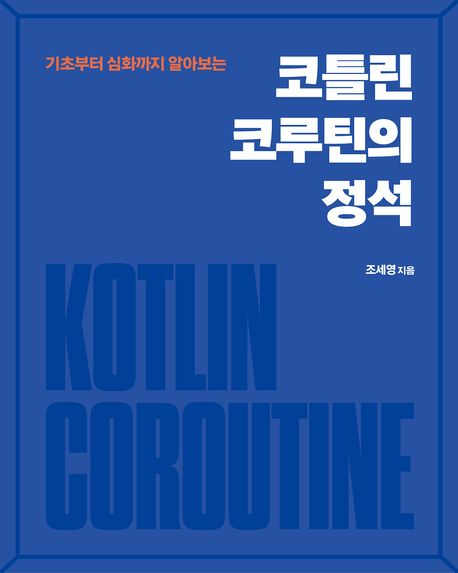

# android-coroutine-study

## 소개

- 많은 개발자들이 어렵게 느끼는 비동기 프로그래밍을 다양한 시각적 자료와 이해하기 쉬운 설명을 통해 누구나 쉽게 이해할 수 있도록 설명된 조세영님의 책 입니다.
- 1장과 2장은 스터디 참여하기 전에 읽어보며 3장부터 12장까지 총 6주간 같이 읽으며 스터디합니다.

### 주차별 목차
- 1주차
    - 3장: CoroutineDispatcher
    - 4장: 코루틴 빌더와 Job
- 2주차
    - 5장: async와 Deferred
    - 6장: CoroutineContext
- 3주차
    - 7장: 구조화된 동시성
- 4주차
    - 8장: 예외 처리
    - 9장: 일시 중단 함수
- 5주차
    - 10장: 코루틴의 이해
    - 11장: 코루틴 심화
- 6주차
    - 12장: 코루틴 단위 테스트

### 진행 방식
- 구글밋에서 카메라를 켜고 서로 얼굴을 보며 스터디 진행
- 각자 공부한 내용을 정리하고 스터디 당일에 추첨으로 발표자 선정
- 발표자가 공부한 내용을 화면 공유하여 발표(녹화 후 비공개 링크로 다시보기 제공)
- 발표가 끝나고 Q&A 진행 및 추가 내용 공유
- 준비해온 문제를 같이 풀어보기

## 기수
- [1기](1기/)
- [2기](2기/)
- [3기](3기/)
- [4기](4기/) 진행 중
- [5기](5기/) 모집 중
    - [참가 신청 링크](https://forms.gle/ugavmqQQLx5x5Gdd9)

### 카카오톡 오픈프로필
https://open.kakao.com/o/slONfVwg